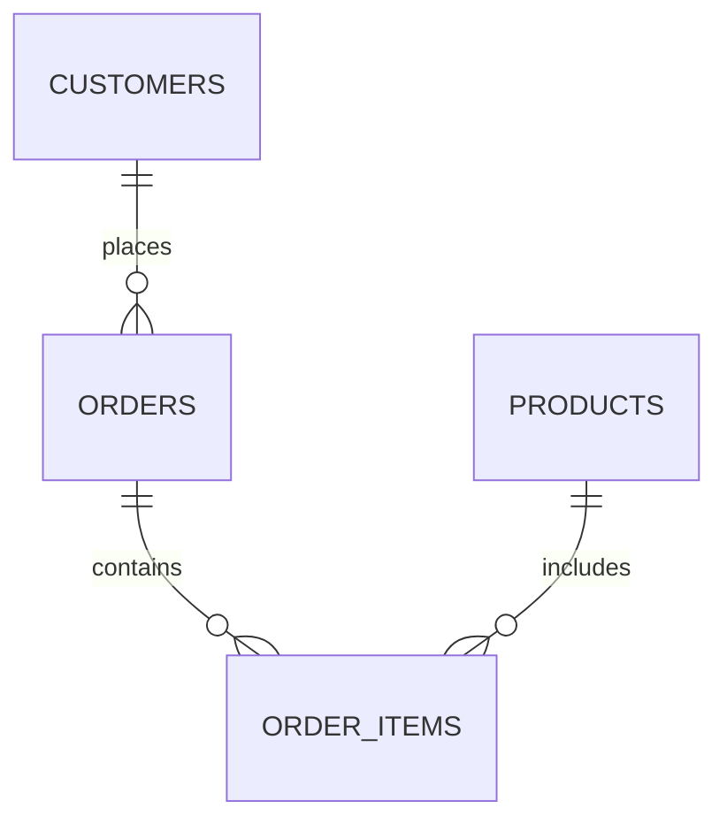
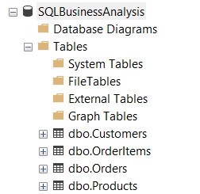
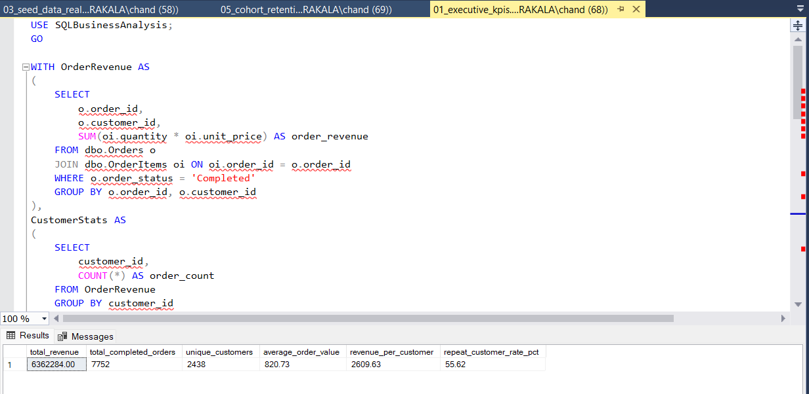
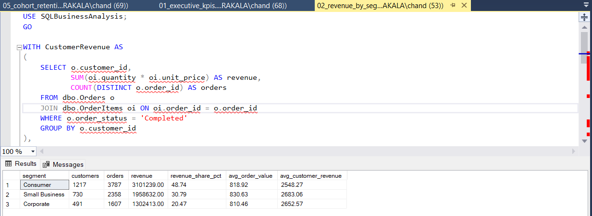
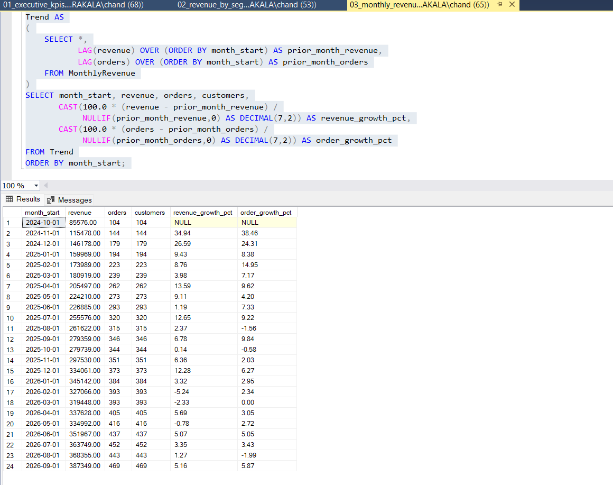
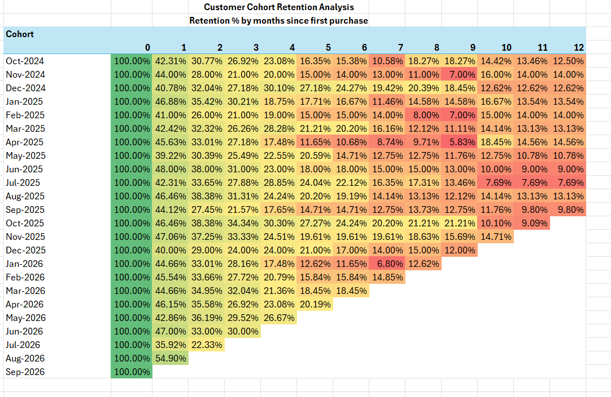
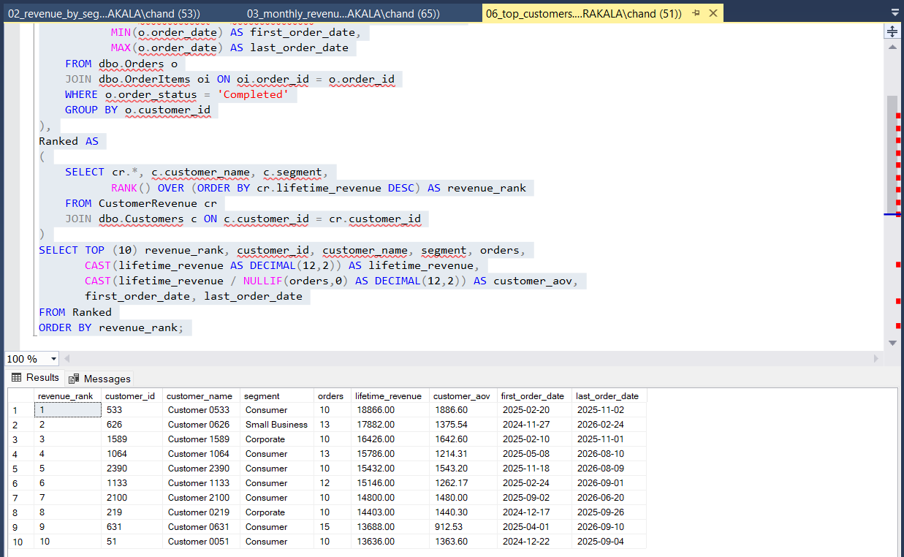
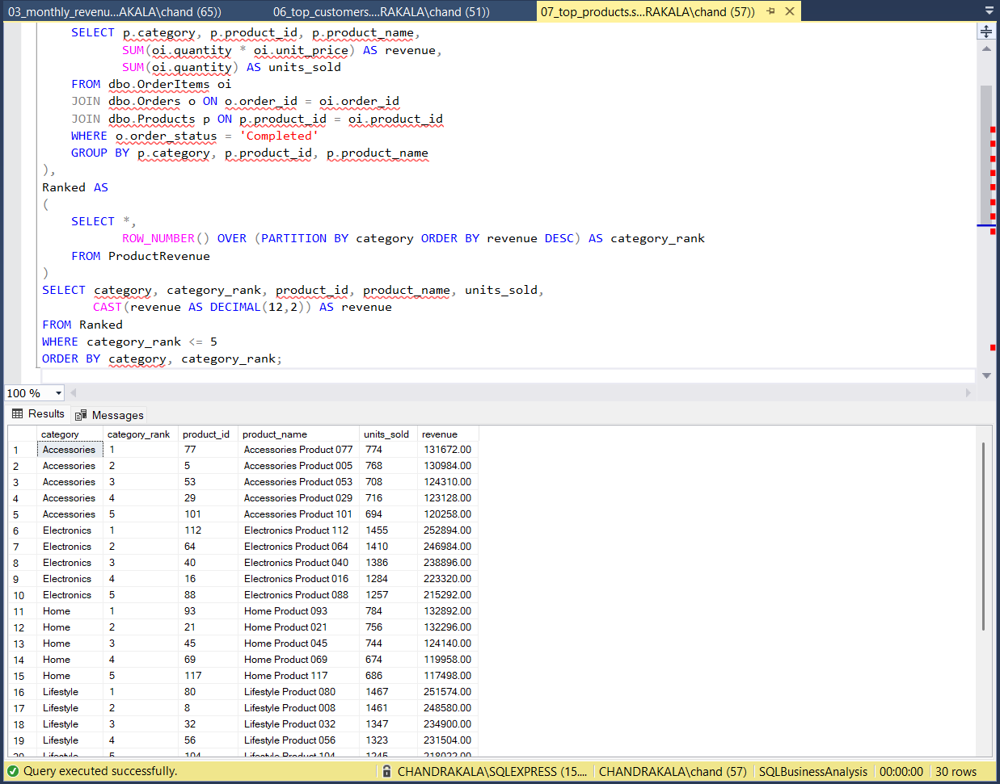

# SQL Business Analysis — E-commerce Customer & Revenue Analytics

An end-to-end **SQL Server / T-SQL business analytics project** analyzing synthetic e-commerce transaction data to uncover revenue trends, customer behavior, cohort retention, customer value, and product performance.

The project demonstrates how SQL can be used to transform transactional data into actionable business insights.

---

## 📊 Executive Summary

This project analyzes a synthetic e-commerce dataset containing customers, orders, order items, and products.

The analysis answers key business questions around:

- Revenue performance
- Customer segmentation
- Monthly revenue trends
- Customer retention
- Cohort behavior
- High-value customers
- Product performance
- Repeat-purchase behavior

The project was built using **Microsoft SQL Server and T-SQL**, with Excel used to create the final cohort-retention heatmap.

---

## 🎯 Business Questions

The analysis was designed to answer the following questions:

1. How much revenue is the business generating?
2. Which customer segments contribute the most revenue?
3. How is revenue changing month over month?
4. How well do customers return after their first purchase?
5. Which customer cohorts have the strongest retention?
6. Who are the highest-value customers?
7. Which products generate the most revenue?
8. What opportunities exist to improve customer retention and revenue?

---


# 🗂️ Data Model

The project uses a simple e-commerce relational model:



### Tables

| Table | Description |
|---|---|
| `Customers` | Customer profile, segment, location, and signup information |
| `Orders` | Order date, customer, status, and sales channel |
| `OrderItems` | Products, quantities, and selling prices for each order |
| `Products` | Product names, categories, costs, and list prices |

📈 Key Findings
1. Revenue by Customer Segment
| Segment | Customers | Orders | Revenue | Revenue Share |
|---|---:|---:|---:|---:|
| Consumer | 1,217 | 3,787 | $3.10M | **48.74%** |
| Small Business | 730 | 2,358 | $1.96M | **30.79%** |
| Corporate | 491 | 1,607 | $1.30M | **20.47%** |


Insight
The Consumer segment generates the largest share of revenue at 48.74%.
However, average order values are relatively similar across segments, ranging from approximately $810 to $831. This suggests that the Consumer segment's revenue leadership is driven primarily by customer and order volume rather than significantly higher order value.
2. Monthly Revenue Trend
Monthly revenue increased from approximately:
$85.6K in October 2024 → $387.3K in September 2026
The overall trend is positive, although several months experienced short-term declines, including February, March, and May 2026.
Insight
The business demonstrates strong long-term revenue growth while still experiencing month-to-month volatility.
This creates an opportunity to investigate:
- Seasonal effects
- Customer acquisition trends
- Product/category performance
- Changes in repeat purchasing
- Channel performance
3. Customer Cohort Retention
The cohort analysis tracks the percentage of customers who make another completed purchase after their first purchase.
For example, the October 2024 cohort shows:
| Cohort Month | Retention |
|---|---:|
| Month 0 | 100.00% |
| Month 1 | 42.31% |
| Month 2 | 30.77% |
| Month 3 | 26.92% |
| Month 4 | 23.08% |
| Month 5 | 16.35% |
| Month 6 | 15.38% |
| Month 12 | 12.50% |


Insight
The largest retention drop occurs during the first 30–60 days after the initial purchase.
This indicates that early customer engagement is a critical opportunity for improving lifetime customer value.
4. High-Value Customers
The top customer in the analysis generated:
- $18,866 lifetime revenue
- 10 orders
- $1,886.60 average order value
High-value customers represent an important opportunity for targeted retention and loyalty initiatives.
Potential strategies include:
- VIP/loyalty programs
- Personalized recommendations
- Early access to products
- Targeted promotions
- High-value customer retention campaigns
5. Top Product Performance
Several products demonstrate significant revenue contribution.
Examples from the analysis include:
Category	Product	Revenue
Electronics	Product 112	$252,894
Lifestyle	Product 080	$251,574


Insight
High-performing products can be used to support:
- Inventory planning
- Cross-selling
- Promotional campaigns
- Category strategy
- Product assortment decisions
💡 Business Recommendations
Based on the analysis, the following actions are recommended:
1. Improve first 30–60 day retention
The strongest retention decline occurs shortly after the first purchase.
Consider:
- Post-purchase email campaigns
- Personalized product recommendations
- Second-purchase incentives
- Loyalty program enrollment
- Targeted re-engagement campaigns
2. Develop a VIP strategy
Identify customers with high lifetime revenue and high order frequency.
Create targeted programs for these customers rather than applying the same strategy to the entire customer base.
3. Focus on the Consumer segment
Consumer customers contribute nearly half of analyzed revenue.
Investigate the drivers behind this performance and identify opportunities to increase:
- Purchase frequency
- Average order value
- Customer lifetime value
4. Monitor revenue declines
Although the overall revenue trend is positive, several months experienced negative month-over-month growth.
These periods should be investigated by:
- Customer segment
- Product category
- Sales channel
- Customer acquisition
- Repeat-purchase behavior
5. Protect top-performing products
High-revenue products should receive additional attention in:
- Inventory planning
- Availability monitoring
- Cross-sell strategies
- Promotional planning
  
# 🖼️ Analysis Results

## Database Structure



## Executive KPIs



## Revenue by Segment



## Monthly Revenue Trend



## Cohort Retention



## Top Customers



## Top Products


 
🧮 SQL Techniques Demonstrated
This project demonstrates practical SQL Server and T-SQL techniques including:
- INNER JOIN / LEFT JOIN
- Common Table Expressions (CTEs)
- Aggregations
- GROUP BY
- CASE expressions
- Date functions
- Conditional aggregation
- NULLIF
- Window functions
- RANK()
- ROW_NUMBER()
- LAG()
- Customer cohort analysis
- Retention calculations
- Revenue and AOV calculations
- Customer lifetime value analysis
- Top-N analysis
- Data validation
- Synthetic data generation

# 📁 Project Structure

```text
sql-business-analysis/
│
├── README.md
├── LICENSE
│
├── data/
│
├── docs/
│
├── results/
│   ├── 01_database_structure.png
│   ├── 02_executive_kpis.png
│   ├── 03_revenue_by_segment.png
│   ├── 04_monthly_revenue_trend.png
│   ├── 05_cohort_retention.png
│   ├── 06_top_customers.png
│   └── 07_top_products.png
│
├── sql/
│   ├── 01_create_database.sql
│   ├── 02_create_schema.sql
│   ├── 03_seed_data.sql
│   ├── 04_validation_checks.sql
│   │
│   └── analysis/
│       ├── 01_executive_kpis.sql
│       ├── 02_revenue_by_segment.sql
│       ├── 03_monthly_revenue_trend.sql
│       ├── 04_customer_cohorts.sql
│       ├── 05_cohort_retention.sql
│       ├── 06_top_customers.sql
│       ├── 07_top_products.sql
│       └── 08_repeat_purchase_analysis.sql
│
└── workflows/
```

---

# 🚀 How to Run

1. **Create the database**

   Run:
   `sql/01_create_database.sql`

2. **Create the schema**

   Run:
   `sql/02_create_schema.sql`

3. **Generate the synthetic data**

   Run:
   `sql/03_seed_data.sql`

   This creates the customers, products, orders, and order-item data used by the analysis.

4. **Validate the data**

   Run:
   `sql/04_validation_checks.sql`

5. **Run the analysis queries**

   Execute the scripts in:

   `sql/analysis/`

The queries produce the business metrics and analysis shown in the results/ folder.

# 🔎 Portfolio Questions

This project can be used to demonstrate answers to common SQL/Data Analyst interview questions.

### Revenue Analysis

- How do you calculate total revenue?
- How would you calculate Average Order Value?
- How would you calculate revenue growth?

### Customer Analysis

- How do you identify repeat customers?
- How would you calculate customer lifetime value?
- How would you segment customers?

### Cohort Analysis

- How do you determine a customer's first purchase month?
- How do you calculate month-over-month cohort retention?
- How would you build a retention heatmap?

### Window Functions

- When would you use `RANK()` vs `ROW_NUMBER()`?
- How does `LAG()` help calculate growth?
- How can window functions identify top customers or products?

### Business Analysis

- Which customer segment generates the most revenue?
- Which products should receive additional attention?
- Where is customer retention weakest?
- What actions could increase repeat purchases?

---

# 🛠️ Tools & Technologies

- Microsoft SQL Server
- T-SQL
- SQL Server Management Studio (SSMS)
- Microsoft Excel
- GitHub

---

# 📌 Dataset

The dataset is **synthetically generated** for portfolio and demonstration purposes.

It contains no proprietary, confidential, or personally identifiable customer information.

The seed script intentionally generates realistic customer cohorts and repeat-purchase behavior so that retention and customer-lifecycle analysis can be demonstrated.

---

# 👨‍💻 Skills Demonstrated

This project demonstrates practical experience in:

- SQL Server
- T-SQL
- Data analysis
- Data modeling
- Business intelligence
- Customer analytics
- Revenue analytics
- Cohort analysis
- Retention analysis
- Window functions
- KPI development
- Data validation
- Business storytelling
- Translating data into business recommendations

---

# 🎯 Portfolio Positioning

This project demonstrates an end-to-end analytics workflow:

```text
Raw Transactional Data
        ↓
SQL Server Data Model
        ↓
Data Validation
        ↓
T-SQL Analysis
        ↓
Business Metrics
        ↓
Customer & Revenue Insights
        ↓
Business Recommendations
```

The goal is not only to demonstrate SQL syntax, but to show how **SQL analysis can be translated into actionable business decisions**.
